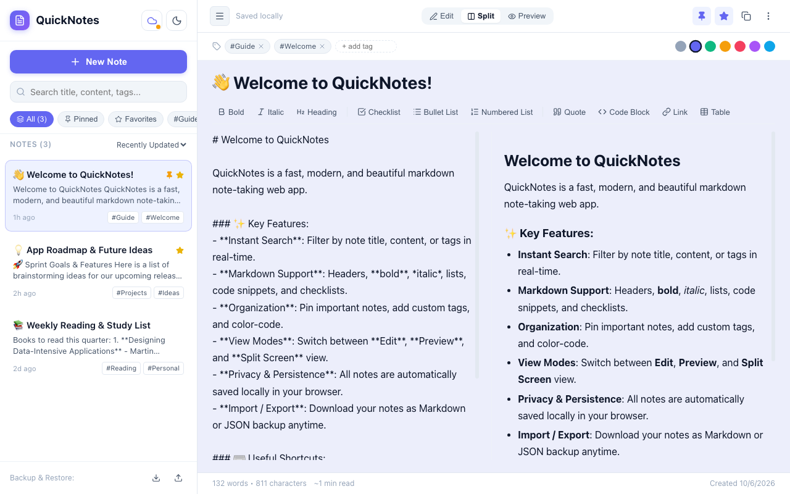

# 📝 QuickNotes — Modern React Note-Taking Web App

[](https://koumudhanjani.github.io/notes_app/)
[](https://react.dev)
[](https://vitejs.dev)

> A sleek, responsive, and distraction-free React note-taking web application featuring real-time Markdown preview, category tagging, full-text search, and local persistence. Accessible on any browser across desktop, tablet, and mobile devices.

### 🌐 Live Demo
🔗 **Website URL:** [https://koumudhanjani.github.io/notes_app/](https://koumudhanjani.github.io/notes_app/)

---

## 📸 App Preview



---

## ✨ Key Features

- **⚡ Blazing Fast**: Built with React 19 & Vite for near-instant rendering and lightning-fast edits.
- **📝 Live Markdown & Multi-View**:
  - Full support for headers, **bold**, *italics*, checklists (`- [ ]`), bullet lists, quotes, code blocks, and tables.
  - Quick-action Markdown toolbar to format text with one click.
  - Three distinct viewing modes: **Edit Mode**, **Preview Mode**, and **Split Screen** (live side-by-side editing and preview).
- **🔍 Instant Search & Categorization**:
  - Real-time search across note titles, contents, and tags.
  - Category filters: **All Notes**, **Pinned**, **Favorites**, and dynamic tag pills (`#tag`).
  - Sort notes by **Recently Updated**, **Date Created**, or **Alphabetical (A-Z)**.
  - Pin important notes to anchor them to the top of the list.
- **☁️ Multi-Device Cloud Sync & Google Auth (New)**:
  - Instant Google Sign-In with real-time Firebase Firestore database sync.
  - Automatically synchronizes notes between your phone, tablet, and laptop.
  - Built-in offline fallback: seamless offline support using local caching.
- **🎨 Custom Styling & Dark Mode**:
  - One-click toggle between **Dark Mode** and **Light Mode**.
  - Pastel note color accents (Indigo, Emerald, Amber, Rose, Purple, Sky).
- **💾 100% Privacy & Local Storage**:
  - Automatically saves all notes in your browser’s `localStorage` — works with or without sign-in.
  - **Export Note**: Download individual notes as `.md` (Markdown) or copy formatted text to clipboard.
  - **Backup & Restore**: Export all notes as a JSON backup file and import them back anytime.
- **📱 Fully Responsive**:
  - Collapsible sidebar and adaptable UI for smooth note-taking on mobile phones and tablets.
- **⌨️ Keyboard Shortcuts**:
  - `Cmd` / `Ctrl` + `N`: Create a new note
  - `Cmd` / `Ctrl` + `S`: Trigger quick-save notification
  - `Cmd` / `Ctrl` + `P`: Toggle pin on the active note

---

## ☁️ Cross-Device Cloud Sync Setup (Firebase Spark - 100% Free)

You can write notes on your laptop and see them appear on your smartphone immediately:

1. **Create a Free Firebase Project**:
   - Go to [Firebase Console](https://console.firebase.google.com/) and create a project.
   - Go to **Authentication** > **Sign-in method** > enable **Google**.
   - Go to **Firestore Database** > **Create database** (Test mode or production mode).
2. **Connect in App**:
   - Open [QuickNotes](https://koumudhanjani.github.io/notes_app/).
   - Click the **Cloud icon ☁️** in the top bar.
   - Paste your `firebaseConfig` object and click **Save Config**.
   - Click **Sign in with Google** — all your notes will now synchronize across every device!

---

## 🚀 Running Locally

### 1. Clone the repository
```bash
git clone https://github.com/koumudhanjani/notes_app.git
cd notes_app
```

### 2. Install dependencies
```bash
npm install
```

### 3. Start development server
```bash
npm run dev
```
Open [http://localhost:5173](http://localhost:5173) in your browser.

### 4. Build for Production
```bash
npm run build
```

---

## 🛠️ Tech Stack

- **Framework**: [React 19](https://react.dev/)
- **Bundler**: [Vite](https://vitejs.dev/)
- **Icons**: [Lucide React](https://lucide.dev/)
- **Markdown Engine**: [Marked](https://marked.js.org/)
- **Hosting**: [GitHub Pages](https://pages.github.com/)

---

## 📄 License

MIT License © 2026 [Anjani Koumudh](https://github.com/koumudhanjani)
